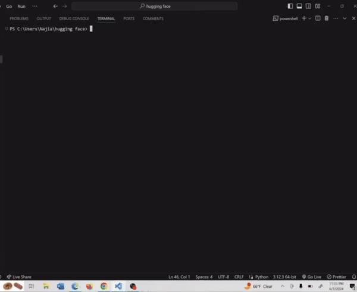
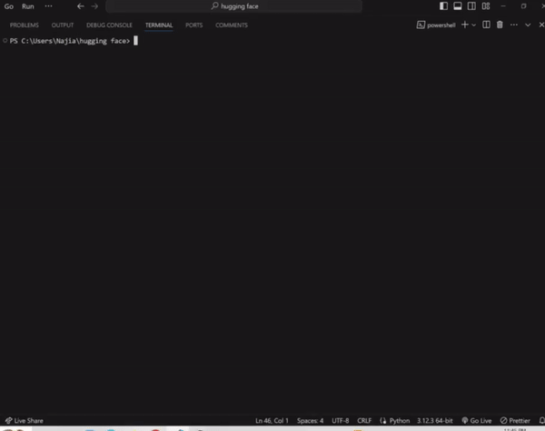

# Image Captioning and Text Generation with Hugging Face Models

Welcome to our repository! This repository contains Python scripts that demonstrate text generation and image captioning using Hugging Face models. We provide two scripts:

- **app.py**: This script generates captions for images using the Salesforce BLIP Image Captioning model via the Hugging Face Hub API.
- **app2.py**: This script allows users to choose between two text generation models (`gpt2` or `EleutherAI/gpt-neo-2.7B`) and generates text based on user input.

## Demo

### app.py - Image Captioning

### app2.py - Text Generation

## How to Use

### app.py
1. Install the required dependencies: `pip install -r requirements.txt`.
2. Set up your `.env` file with your Hugging Face API token.
3. Run the script: `python app.py`.
4. Enter the URL of the image when prompted.
5. The generated caption will be displayed.

### app2.py
1. Install the required dependencies: `pip install -r requirements.txt`.
2. Run the script: `python app2.py`.
3. Choose a model (`gpt2` or `EleutherAI/gpt-neo-2.7B`).
4. Enter the text prompt, maximum number of tokens to generate, and other options as prompted.
5. The generated text will be displayed.

## Requirements

- Python 3.x
- `requests`
- `torch`
- `transformers`
- `python-dotenv`

Feel free to contribute, report issues, or suggest improvements! Happy coding!
